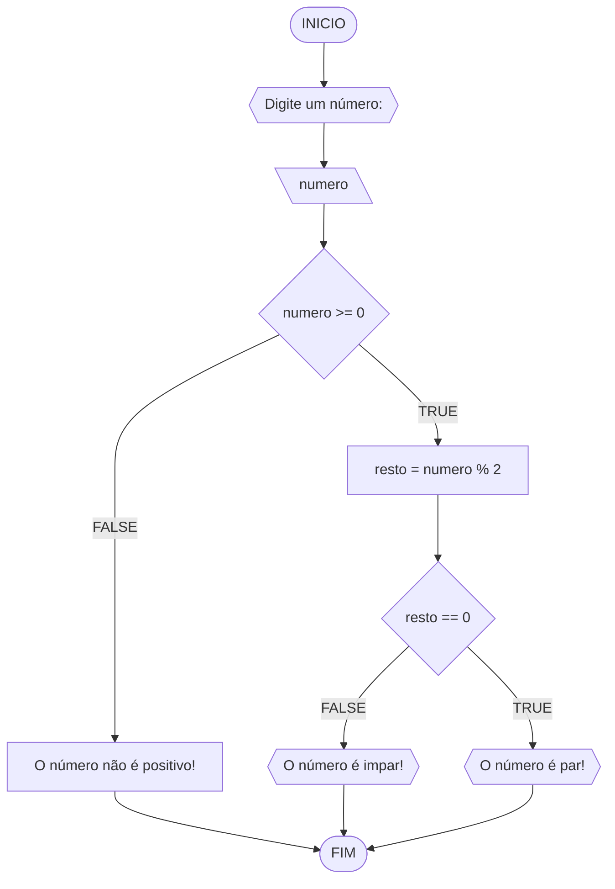
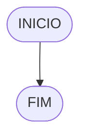

# UNIFOR
**Nome**: Breno Baís <br>
**Disciplina**: Raciocínio lógico algorítmico

## Lista de exercícios 01

### Exercício 01 (1 ponto)
Represente, em fluxograma e pseudocódigo, um algoritmo para determinar se um número inteiro e positivo é par ou impar.

#### Fluxograma (0,25 ponto)



#### Pseudocódigo (0,5 ponto)
```
1  ALGORTIMO verifica_par_impar
2  DECLARE numero, resto: INTEIRO
3  ESCREVA "Digite um número: "
4  INICIO
4  LEIA numero
5  SE numero >= 0 ENTAO                  // verifica se o inteiro é positivo
6    resto = numero % 2                 // calcula o resto da divisão por 2
7    SE resto == 0 ENTAO                // verifica se o resto é igual a zero
8      ESCREVA "O número é par!"
9    SENAO
10     ESCREVA "O número é impar!"
11   FIM_SE
11  SENAO                                // caso inteiro for negativo (condição linha 5)
12    ESCREVA "O número deve ser postivo!"
13  FIM_SE
13 FIM
```

#### Teste de mesa (0,25 ponto)
| numero | numero >= 0 | resto | resto == 0 | Saída |
| -- | -- | -- | -- | -- | 
| -1 | F |   |   | "O número deve ser postivo!" |
| 0  | V | 0 | V | "O número é par!" |
| 13 | V | 1 | F | "O número é impar!" |
| 30 | V | 0 | V | "O número é par!" |

## Exercício 02 (3 pontos)
Represente, em fluxograma e pseudocódigo, um algoritmo para calcular o novo salário de um funcionário. 
Sabe-se que os funcionários que recebem atualmente salário de até R$ 500 terão aumento de 20%; os demais terão aumento de 10%.

#### Fluxograma (1.0 ponto)


#### Pseudocódigo (1.0 ponto)

```
Algoritmo ContaAprovacoes
1 DECLARE salario, novo salario1, novo salario2
2 ESCREVA "Digite o salário: "
3 INICIO
4 LEIA salario
5 SE salario <= 500 ENTAO                             //verificar se o salário é menor ou igual a 500
6 novo salario1 = salario + salario*20/100           //calcular o novo salário
7 ESCREVA "o novo salário é +novo salario1+!"
8 FIM_SE
9 SENAO                                             //caso salário for maior que 500 (condição linha 5)
10 novo salario2 = salario + salario*10/100
11 ESCREVA "O novo salário é +novosalario2+!"
12 FIM_SE
FIM_ALGORITMO
```

#### Teste de mesa (1.0 ponto)

|       salario       |       salario <= 500       |        novo salario1      |      novo salario2        |      Saída        | 
|      --       |      --      |      --      |      --      |      --      | 
|       500       |       V       |     600     |      --      |      --      |
|       600       |       F       |      --     |      660     |      --      |

## Exercício 03 (3 pontos)
Represente, em fluxograma e pseudocódigo, um algoritmo para calcular a média aritmética entre duas notas de um aluno e mostrar sua situação, que pode ser aprovado ou reprovado.

#### Fluxograma (1 ponto)


#### Pseudocódigo (1 ponto)

```
Algoritmo ContaAprovacoes
1 DECLARE média, nota1, nota2
2 ESCREVA "Digite a primeira nota:"
3 ESCREVA "Digite a segunda nota:"
4 INICIO
5 LEIA nota1
6 LEIA nota2
7 media = (nota1 + nota2) / 2             //calcular a media
8 SE media >= 6 ENTAO                    //verificar se a média é maior ou igual a 6
9 ESCREVA "O aluno está aprovado"
10 SENAO                                //caso a média for menor que 6 (condição linha 8)
11 ESCREVA "O aluno está reprovado"
12 FIM_SE
FIM_ALGORITMO
```

#### Teste de mesa (1 ponto)

|    nota1     |      nota2      |      media        |     aprovação         |    Saída          | 
|      --      |      --      |      --      |      --      |      --      | 
|       4      |     10       |       7       |      V        |      --      |
|       7      |      3       |       5       |      F        |      --      |

## Exercício 04 (3 pontos)
Represente, em fluxograma e pseudocódigo, um algoritmo que, a partir da idade do candidato(a), determinar se pode ou não tirar a CNH. 
Caso não atender a restrição de idade, calcular quantos anos faltam para o candidato estar apto.

#### Fluxograma (1.0 ponto)



#### Pseudocódigo (1.0 ponto)

```
Algoritmo ContaAprovacoes
1 DECLARE idade, anosrestantes
2 ESCREVA "Informe a sua idade:"
3 INICIO
4 LEIA idade
5 SE idade <= 18 ENTAO                    //verificar se a idade é maior ou igual a 18
6 anosrestantes = idade - 18
6 ESCREVA "O candidato pode não tirar a CNH"
7 ESCREVA "Faltam +anosrestantes+ para poder tirar a CNH"
7 SENAO                                 //caso idade for maior que 18 (condição linha 5)
8 ESCREVA "O candidato pode tirar a CNH"
9 FIM_SE
FIM_ALGORITMO
```

#### Teste de mesa (1.0 ponto)

|      idade        |      idade <= 18        |       permissão       |      anosrestantes        |     Sáida         | 
|      --      |      --      |      --      |      --      |      --      | 
|       20       |      F        |      V        |     --       |              |
|       11       |       V       |      F        |      7       |              |

